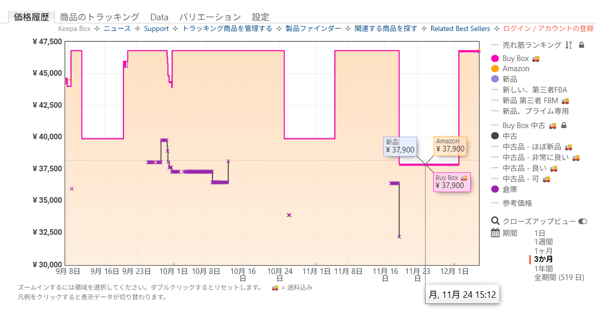
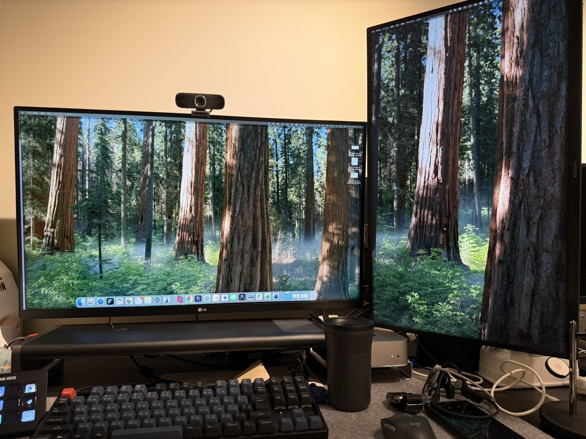

# BlackFriday(2025)購入：4K 31.5インチモニター(LG / 32UR500K-B) 

* * *

※この記事にはアフィリエイトリンクが含まれています

## ブラックフライデーで設備投資

今日は土曜日なので軽めで、ブラックフライデー、道具の話題です。  
今回 (2025年) はオフィスのディスプレイを追加しました。

[ **LG モニター ディスプレイ 32UR500K-B 31.5インチ / VA / 4K (3840×2160) / 約10.7億色表示(8bit+FRC) / HDR10 / DCI-P3 90% / アンチグレア/ブルーライト低減/フリッカーセーフ / 5W+5Wスピーカー / HDMI×2、DisplayPort/チルト調整対応 / 3年安心・無輝点保証** __ _amzn.to_ _46,700 円_ (2025年12月06日 09:26時点 詳しくはこちら) Amazon.co.jpで購入する  ](https://amzn.to/4pm6A3p) 

LG 31.5インチ 4Kモニター（￥46,700 →￥37,900）です。

ブラックフライデーで直近の最安値

既存のXiaomi 27インチ 2Kモニターは縦置きにして、デュアルディスプレイ環境を構築しました。

[ **【Amazon.co.jp 限定】LG ゲーミング モニター ディスプレイ 27UL500-W 27インチ/4K/HDR(標準輝度:300cd/㎡)/IPS非光沢/HDMI×2、DisplayPort/FreeSync/ブルーライト低減** __ _amzn.to_ _21,700 円_ (2025年12月06日 09:28時点 詳しくはこちら) Amazon.co.jpで購入する  ](https://amzn.to/4iGoKKJ) 

[ **HUANUO (ファーノー) PCモニターアーム デュアル 液晶ディスプレイアーム 2画面 13～32インチ対応 耐荷重2～9kg ガススプリング式 グロメット式＆クランプ式 VESA100*100 多角度調節 ケーブル収納 HNDS8** __ _amzn.to_ _7,999 円_ (2025年12月06日 09:29時点 詳しくはこちら) Amazon.co.jpで購入する  ](https://amzn.to/44F4xiw) 

私のディスプレイ遍歴の紹介と「ちょうどいい」を見極める過程を書いてみます。

## ディスプレイ遍歴──試行錯誤の記録

以前（会社員時代）は自宅で23インチを横に並べて使っていました。買いやすい値段だったので。  
ただ、体の正面にベゼルが来てしまうのと横に長すぎるので、フリーランスの投資として LG 34インチのウルトラワイド曲面ディスプレイ（21:9、3440×1440）を導入しました。(2022年の購入価格：￥53,399)

[ **LG ゲーミング モニター UltraGear 34WP65C-B 34インチ/21:9 曲面 ウルトラワイド(3440×1440)/VA/160Hz/1ms MBR/HDR/FreeSync Premium/HDMI×2,DisplayPort×1/スピーカー/高さ調節/3年安心・無輝点保証** __ _amzn.to_ _138,900 円_ (2025年12月06日 09:30時点 詳しくはこちら) Amazon.co.jpで購入する  ](https://amzn.to/4avvJnx) 

作業領域は広がりましたが、結局は左右２分割で使ってる（34インチだと3分割は各ウィンドウが狭い）のであまり感動はなく、引っ越しのとき「扱いづらい」のも問題となりました。もう買わないと思います。

そして法人設立後に契約したオフィスには、扱いやすそうな Xiaomi 27インチ 2K（￥18,980）を導入。2Kで十分だと感じていました。  
しかし生成AIを複数プロジェクトで使い始めると画面が手狭になってきました。

Gemini、Claude、ChatGPT などのチャット画面や、AI エディタの Cursor、Windsurf、Kiro、Antigravity、そしてブラウザ──これらを同時に開いて作業する機会が増えたのです。

## "ちょうどいい"を見極める

31.5インチ 4Kをメインに据えて、既存のXiaomiモニターは活かすことにしました。[Day2](https://note.com/yusukemori_ravi/n/nc015da97751e)で書いた経営理念「在るものを尊び、自在に活かす」の実践です。縦置きにして上下分割で利用すれば、ドキュメント確認やログ監視に最適です。

メイン4K サブ2K縦置き (M4 Mac mini, Anker ドッキングステーション)

これが今の私にとっての「ちょうどいい」過剰でも不足でもない、最適化された環境となりました。

  * 34インチウルトラワイドほど大げさではない

  * 23インチ×2ほど煩雑ではない

  * 必要十分な作業領域を確保できる

  * 既存資産（Xiaomi）も無駄にしない

## 生成AI時代の作業環境

現在は縦置きの Xiaomi ディスプレイに、2つのプロジェクトをWindsurfとAntigravityで開いています。  
31.5インチ 4Kのメイン画面で作業しながら、縦置き27インチでドキュメントやログを確認する──しばらくこの構成でやってみます。

生成AIが実装やドキュメント作成を支援してくれる状況なので、「複数のタスク、コンテキストを同時に扱える環境」で生産性が上げられると思います。

## 設備投資も道具選びも「ちょうどいい」を意識する

4Kディスプレイは値段が幅広いです。  
正直、細かい仕様までは分かりません。「高い商品は色の再現性が高かったりリフレッシュレートが高いなどクリエイターやゲーミングの高度な仕様なんだろうな、事務作業には要らないからそこそこでいいや」という感覚です。

額を考えずに「欲しい」だけでいうと Dell の Thunderbolt ハブ機能がついてる20万円程度のディスプレイになりますが、今回はLGブランドで￥37,900という「そこそこ」の投資額で決めました。日々8時間以上、おそらく3年は使う道具への投資としては安いと思っています。

「高ければいい」わけでも「安ければいい」わけでもない。自分の働き方に合った「ちょうどいい」を見極める──これは設備投資、道具選びでも同じですね。

明日は一週間の振り返りを行いたいと思います。  
どうぞよろしくお願いします。

---

**原文URL**: [https://note.com/yusukemori_ravi/n/na5d996d1d7ae](https://note.com/yusukemori_ravi/n/na5d996d1d7ae)
**公開日**: 2025年12月12日
**更新日**: 2025年12月6日
**取得日**: 2025年12月12日
