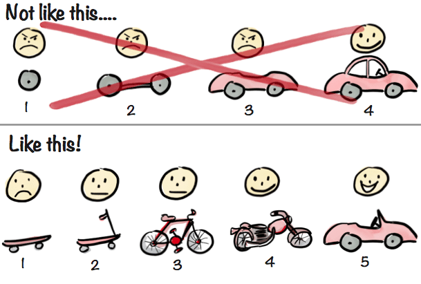

# Amazon も最初はシステム持たずに手動ーーMVP という考え方

## 小さく創り続けることで、予想外の価値ある仏像が見えてくる

前日の記事 [Day9](https://note.com/yusukemori_ravi/n/nccb606b69dab) で、こう書きました：

> "仏" が見えてはいますが、役職や役割が違うそれぞれの **"曖昧" な仏の姿** しか見えてません。

[仏像を彫るようなわけにはいかない ─ ソフトウェア開発の複雑性](https://note.com/yusukemori_ravi/n/nccb606b69dab)

複数人で仏像を彫ろうとすると、それぞれ見える仏が違います。  
いきなり誰かが、例えば IT部門が経営者の言葉だけを元に完成形を彫ろうとすると、いろんな人がいろいろ言います。

  * 経営者：「もっとなんというか・・」

  * コンサルタント：「最新の技術を使って完璧な仏像を彫りましょう！」

  * 経理部門：「買ったほうが早くないですか？」

**では、どうすればいいのでしょうか？**

## MVP（Minimum Viable Product） という考え方

答えはシンプルです。

**少しずつ彫って、確認して、すり合わせる。**

ここで **MVP** という概念を説明します。

私が MVP の考え方を理解するために大きな力となったイラストがあります。

スウェーデンのアジャイルコーチ、Henrik Kniberg が描いた有名なイラストです。  
（「アジャイル」については Day11 で触れる予定です）

**参考** : [Making sense of MVP (Minimum Viable Product) – and why I prefer Earliest Testable/Usable/Lovable](https://blog.crisp.se/2016/01/25/henrikkniberg/making-sense-of-mvp)（MVP（Minimum Viable Product）の意味を理解する – そして、なぜ私が早期テスト可能/使用可能/愛される製品を好むのか）

上記参考記事より転載

**Not like this …. (こうじゃない….)**

車を作るために、フロントタイヤ → シャーシ → 車体 → 完成（途中で使えないのでフィードバックなし）

顧客は途中まで不満で、最終的には注文した製品が届いてまあまあ納得している表情です。

**Like this ! (こうする ! )**

『顧客の根本的なニーズは「**A地点からB地点までより早く移動したい** 」というものであり、車はその解決策の一つに過ぎない』として、『フィードバックを得られるような、考えられる限り最小限のものを提供』しつづけてフィードバックを得ます。

スケートボード → 自転車 → バイク → 車（各段階でフィードバックを得る）

「お客様は顔に新鮮な空気を感じるのが好き」というフィードバックにより、オープンカーが完成して顧客が満足そうな顔をしています。:)

## まとめ

簡単な説明でしたが MVP についてイメージして頂けたでしょうか。

この例では最終的に普通のセダンからオープンカーになりました。  
顧客が注文時に想像してなかった「顔に新鮮な空気を感じる」という価値が追加されてました。

Amazon も有名な MVP 実践者です。  
創業当初はオンライン書店として本のみを扱い、在庫を持たずに注文が入るたびに手動で仕入れて発送することで、需要とサービス価値を検証した言われています。

> Amazon でさえ、ジェフ・ベゾスが自宅から本を個人的に発送するという MVP から始まりました。

[スタートアップ MVP - 実用最小限の製品が、最大の潜在的価値を提供する理由](https://aws.amazon.com/startups/learn/prove-whats-possible-startup-mvp-offers-max-value-potential?lang=ja)

この記事を読んで頂いたみなさんもぜひ MVP の考え方を意識して頂ければと思います！

明日（Day11）は、**この「少しずつすり合わせる」を実践するための文化** を紹介します。

よく耳にする単語 **「アジャイル」** です。

---

**原文URL**: [https://note.com/yusukemori_ravi/n/n07415e55f3f1](https://note.com/yusukemori_ravi/n/n07415e55f3f1)
**公開日**: 2025年12月12日
**更新日**: 2025年12月10日
**取得日**: 2025年12月12日
