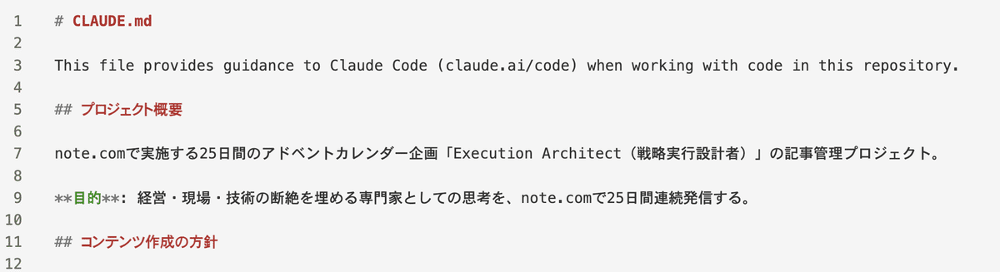
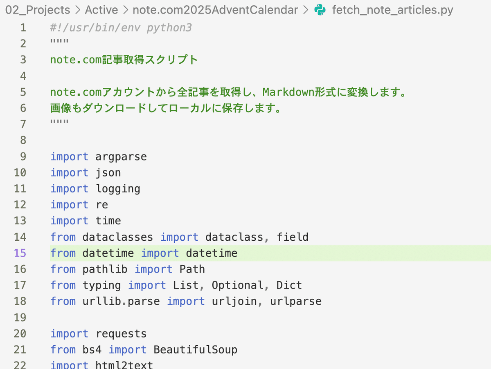
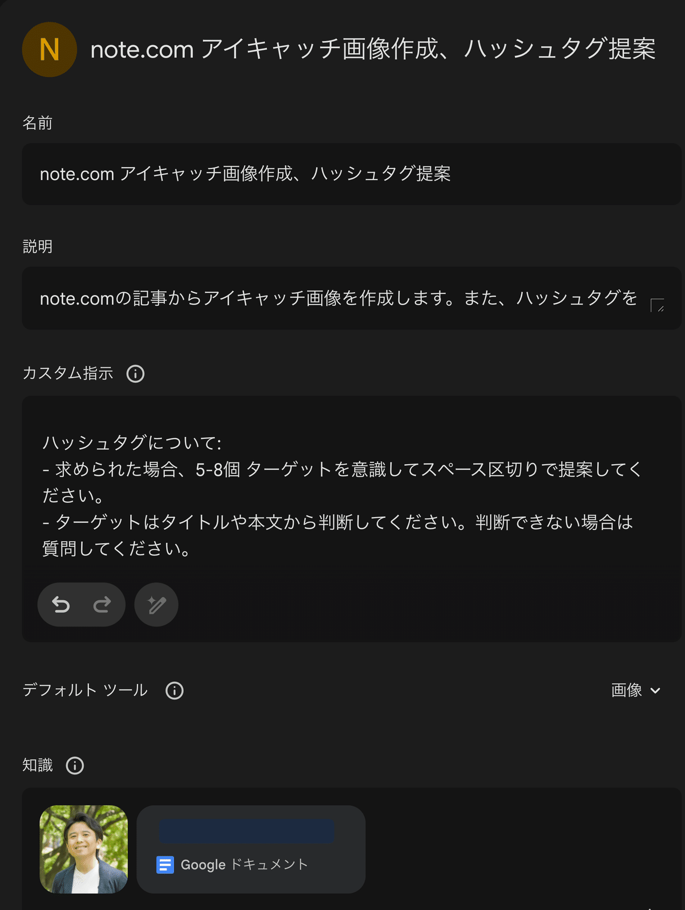

# 発信だけでは足りない ─ 毎日投稿25日間での気づき

## 2025年アドベントカレンダー最終日

12月1日から始めたこのアドベントカレンダー、今日で25日目。  
読んでくださった方、ありがとうございます。

最終回なので、25日間の振り返りではなく「発信」について本音を書きます。

* * *

## なぜ25日間書こうと思ったのか

きっかけは、ある発信者でした。

> 田中渓( [@KeiTanaka_Radio](https://twitter.com/KeiTanaka_Radio?ref_src=twsrc%5Etfw) ) さんの発信を追ってて  
> ・「発信は人それぞれの形でデザインする(できる)もの」で  
> ・「発信力/影響力のなさはリスク」という焦り  
> みたいな感情が大きくなってきた。  
>   
> これから自分で作りに行こう。  
> (自然に使ってても変化は起きない)[#kp897](https://twitter.com/hashtag/kp897?src=hash&ref_src=twsrc%5Etfw)
> 
> — 毛利 裕介｜経営戦略を実行に結びつける、開発出身の実装型コンサルタント (@rabirgo) [November 18, 2025](https://twitter.com/rabirgo/status/1990893525731529178?ref_src=twsrc%5Etfw)

「発信は人それぞれの形でデザインできるもの」  
「発信力・影響力のなさはリスク」

例えば何かを広めたいと思っても、発信力がない。  
発信力なければ、人も近づいてくれない。  
自然に使っていても変化は起きない。自分で作りに行こう。

そう思いアドベントカレンダーというきっかけを使って書いてみることにしました。

* * *

## 正直に言うと、書くので精一杯

日常業務をこなしながら、毎日書く。  
生成AIを使っても想像以上に時間がかかりました。

AIが出してくる文章は、どこか「note.comっぽい」。  
結局、AIが出した文章を「自分の言葉だ」と納得できるまで修正する。  
その作業に時間がかかりました。

* * *

## AIとの協業で工夫したこと

うまくいったこともあります。

**CLAUDE.mdの活用**

私が使っているAIツール「Claude Code」には、CLAUDE.mdという設定ファイルがあります。  
ここにプロジェクトの背景、自分のプロフィール、文体の好みなどを書いておく。  
AIが文脈を理解した状態で書いてくれます。

CLAUDE.mdの冒頭

**過去記事を読ませる**

note.comから記事を取得してMarkdownにするスクリプトを、生成AIに作ってもらいました。  
過去に書いた記事を読ませると、一貫性のある内容が出やすくなりました。

AIに書いてもらった公開済みの記事を取得するスクリプト

**インタビュー形式**

「私に質問してください」とAIに頼んで私が答えると、それをもとにAIが文章化してくれる。

この方法は、自分の言葉を引き出すのに有効でした。

* * *

## アイキャッチ画像は苦労した

毎回違うテイストになってしまう問題。

nano banana proを使っていましたが方向性が定まりませんでした。  
Gem に自分のアイコン写真を入れると、安定するようになりました。

Gemini GEM にアイコンを入れると似顔絵にしてくれるようになった

画像生成AIも、コンテキストがないと一貫性が出ない。

文章と同じですね。

* * *

## 25日間で気づいたこと

**発信だけでは影響力は持てない。**

記事を書いて公開する。それだけでは足りない。  
noteのスキ、コメント、SNSでのやり取りなどコミュニケーションが必要だと感じました。

双方向のコミュニケーションが次の課題です。

* * *

## 2026年に向けて

発信は続けます。

できれば毎日、と言いたいところですが、時間次第。  
内容は学習も兼ねて中小企業診断士の話題になりそうです。

25日間で「発信の筋トレ」はできた気がします。  
あとは続けること。

* * *

## 25日間、ありがとうございました

25日間、私の考えや経験を書いてきました。

もしよければ、過去の記事も読んでみてください。  
私がどんな人間で、何を大切にしているか、価値観のようなものが伝わればいいなと思います。

何かを感じたら、ぜひご連絡ください。  
きっと良い仕事ができると思っています。

**株式会社ラヴィ 毛利 裕介**

[ **お問い合わせ | 株式会社ラヴィ** _株式会社ラヴィ（福岡市博多区）は、中小企業の成長痛に寄り添う伴走型DXパートナーです。迷いをほどき、賢明な選択肢を設計し、_ _www.ravi.fukuoka.jp_ ](https://www.ravi.fukuoka.jp/contact)

（年末はOGPの画像も修正しなきゃ・・）

* * *

**25日間の記事一覧** :

**Week1: 私は何者か**

  * [Day1: 私のPivot：SIerサラリーマンから経営者・実装型IT/DXコンサルタントへ](https://note.com/yusukemori_ravi/n/n11c83353075c)

  * [Day2: 【株式会社ラヴィ】在るものを尊び、自在に活かす─小さな実装型コンサル会社の紹介](https://note.com/yusukemori_ravi/n/nc015da97751e)

  * [Day3: DXが進みそうで進まない理由──ITは簡単に見える。だから"詳しそうな人"と"銀の弾丸"に頼ってしまう。](https://note.com/yusukemori_ravi/n/na85286924cea)

  * [Day4: "戦略実行設計者"──ってなに？](https://note.com/yusukemori_ravi/n/n344e56a81c58)

  * [Day5: スティーブ・ジョブズ "Connecting the dots"──私が紡いだ "the dots" は「戦略実行設計者」となった](https://note.com/yusukemori_ravi/n/na3f6f4e2138e)

  * [Day6: BlackFriday(2025)購入：4K 31.5インチモニター(LG / 32UR500K-B)](https://note.com/yusukemori_ravi/n/na5d996d1d7ae)

  * [Day7: コペル21少年から実装型コンサルタントへ](https://note.com/yusukemori_ravi/n/n5948433e681c)

**Week2: なぜソフトウェア開発は難しいのか**

  * [Day8: 経営者「ECサイトとPOSの売上を分析できるようにしよう」から始まる二つの世界線](https://note.com/yusukemori_ravi/n/n84016de149a2)

  * [Day9: 仏像を彫るようなわけにはいかない ─ ソフトウェア開発の複雑性](https://note.com/yusukemori_ravi/n/nccb606b69dab)

  * [Day10: Amazon も最初はシステム持たずに手動ーーMVP という考え方](https://note.com/yusukemori_ravi/n/n07415e55f3f1)

  * [Day11: 完璧な計画より、続けられる計画 ─ アジャイルの本質](https://note.com/yusukemori_ravi/n/n61569bb063ca)

  * [Day12: 要件定義ってどうやるの？「As a, I want to, because を使ってみて」─ ユーザーストーリーマッピング](https://note.com/yusukemori_ravi/n/nb54a99792d78)

  * [Day13: システム開発やDXの複雑性への対策まとめ(Week 2 まとめ)](https://note.com/yusukemori_ravi/n/n1b841dd7cdfc)

  * [Day14: 森博嗣「自由をつくる 自在に生きる」ーー自由自問で出会った本](https://note.com/yusukemori_ravi/n/n3d54705b41f6)

**Week3: なぜ「実装型」を名乗るのか**

  * [Day15: なぜ「実装型」を名乗るのか ─ 技術を手放さなかった理由](https://note.com/yusukemori_ravi/n/nab3d96ebabcd)

  * [Day16: デジタル人材の不足→伴走支援で「枯れた」IT技術を使うことをお勧めします](https://note.com/yusukemori_ravi/n/n23d13505d5cd)

  * [Day17: ノーコードプログラミングへの期待と不安 ─ 私が「ポータブルな技術」を選ぶ理由](https://note.com/yusukemori_ravi/n/n4c006b3a8e88)

  * [Day18: 実装型コンサルタントが出来ること ─ エンジニアの技術を活かしたコスパDX](https://note.com/yusukemori_ravi/n/nd1fdea34b60b)

  * [Day19: ITコンサルタントと開発会社が「技術者の言葉」でコミュニケーションできたら ─ 実装型の「伝えられる」スキル](https://note.com/yusukemori_ravi/n/ne9f373cd740a)

  * [Day20: 「実装型」コンサルタントの3つ価値＋α ─ Week3 まとめ](https://note.com/yusukemori_ravi/n/na0251942cff2)

  * [Day21: 「できない」を「できる」に変えてくれた生成AI ─ 実装型IT/DXコンサルタントの活用スタイル](https://note.com/yusukemori_ravi/n/n5092220dc1a3)

**Week4: 誰のための専門家か**

  * [Day22: IT/DXを専門としないコンサルタントの方へ ─ 実装型コンサルタントとの協業という選択肢](https://note.com/yusukemori_ravi/n/nc3db1139006d)

  * [Day23: 41%が顧問先からIT相談を受けている ─ 士業の方へ](https://note.com/yusukemori_ravi/n/nfb3a403b90f3)

  * [Day24: 経営者のダークサイドを救う ─ 経営と技術の間に立つ「実装型」コンサルタント](https://note.com/yusukemori_ravi/n/n9f9f4b25bfb1)

---

**原文URL**: [https://note.com/yusukemori_ravi/n/n95b7d5e9c29f](https://note.com/yusukemori_ravi/n/n95b7d5e9c29f)
**公開日**: 2025年12月26日
**更新日**: 2025年12月25日
**取得日**: 2025年12月26日
